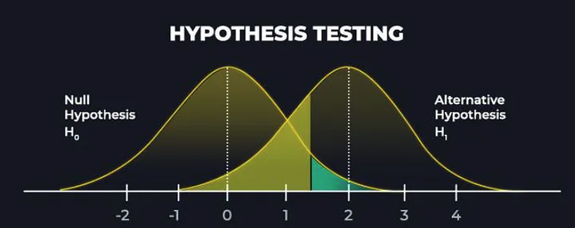

# Junior Data Analyst

#### Technical Skill: R, SQL, Java, Python

## Education
- B.A.A.S, University of Pennsylvania| Data Analytics & Social Sciences (_August 2024_)
- A.S, Community College of Philadelphia | Computer Science (_May 2021_)

## Experience
Data Analyst and Programmer Intern @ Senior Grooming (_August 2023_)

- Analyzed demographic data with R to produce reports that supported strategic expansion.
- Programmed Java for API integrations with SendGrid to manage transactional emails.
- Developed custom email templates in SendGrid, improving user experience and ensuring brand consistency.
  
## Project
### 1. Regression Analysis in Base R     
[Publication](https://github.com/naokoi0408/Final.Data310/blob/main/Regression%20Analysis%20/Regression_Analysis%20.pdf)

Utilized regression analysis, multivariate regression, statistical, and probability analysis on 2020 US National Election Survey data to assess voter sentiment towards the Democratic Party. Applied sampling theory, cleaned data, and created concise visualizations to summarize findings.
- Skills: R, statistics, data visualization.

### 2. R-Shiny
[Publication](https://github.com/naokoi0408/School_Rank_App/blob/main/School_Rank_App/School_Rank_App_Description.pdf)

Developed a Shiny application with Leaflet widgets for Philadelphia schools and LEA datasets, focusing on attendance-based rankings. Utilized text analysis and integrated SQL within R for advanced geospatial analysis.
- Skills: R, Shiny, data visualization, UI/UX.

### 3. SQL Data Project
[Publication](https://github.com/naokoi0408/SQL/blob/main/SQL/SQL.RStudio.pdf)

The analysis compares median annual salaries across companies of different sizes, finding that companies with around 1000 employees pay between $250,000 and $260,000, while larger mega-companies offer slightly higher median salaries of $268,000 to $275,000. This highlights a trend of increasing salaries with company size.
- Skills: SQL, database management, data transformation.

### 4. Hypothesis Testing and Estimators
[Publication](https://github.com/naokoi0408/HypothesisTesting/blob/main/Hypothesis_Testing/HypothesisTesting.pdf)

Hypothesis testing in these regressions evaluates whether the independent variables (like education level or region) have a statistically significant impact on the dependent variables (like median income or commute behavior). It tests whether the observed relationships are due to chance, with the null hypothesis assuming no effect and the alternative suggesting a significant effect.
- Skills: Statistics, R/Python, hypothesis testing.

### 5. Data Cleaning and Transformation
[Publication]
- Skills: R, SQL, data wrangling, tidying datasets.

### 6. Simulate Rolling and Dice
[Publication]

