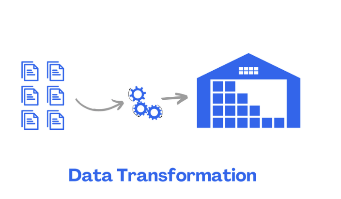

# Junior Data Analyst

#### Technical Skill: R, SQL, Java, Python

## Education
- B.A.A.S, University of Pennsylvania| Data Analytics & Social Sciences (_August 2024_)
- A.S, Community College of Philadelphia | Computer Science (_May 2021_)

## Experience
Data Analyst and Programmer Intern @ Senior Grooming (_August 2023_)

- Analyzed demographic data with R to produce reports that supported strategic expansion.
- Programmed Java for API integrations with SendGrid to manage transactional emails.
- Developed custom email templates in SendGrid, improving user experience and ensuring brand consistency.

## Certifications
- Introduction to Database and SQL, Great Learning (_June 2024_)
  
## Project
### Regression Analysis in Base R     
[Publication](https://github.com/naokoi0408/Final.Data310/blob/main/Regression%20Analysis%20/Regression_Analysis%20.pdf)

Utilized regression analysis, multivariate regression, statistical, and probability analysis on 2020 US National Election Survey data to assess voter sentiment towards the Democratic Party. Applied sampling theory, cleaned data, and created concise visualizations to summarize findings.
- Skills: R, statistics, data visualization.

### Diabetes Research Analysis
[Publication](https://github.com/naokoi0408/Portfolio/blob/main/assets/Data_Analysis_Project_Final.ver%20(1).pdf)

Analyzed 20,000 rows of data to examine the correlation between clone size and mutation in healthy and diabetic samples. Performed hypothesis testing to find significant results, indicating a notable increase in mean clone size in diabetic individuals. Created bar graphs to assess V-gene usage consistency across six donors, highlighting higher values in diabetes. This research suggests potential factors for risk prediction and prevention in Type 1 diabetes.
- Skills: R, statistics, hypothesis testing, data visualization.

### R-Shiny
[Publication](https://github.com/naokoi0408/School_Rank_App/blob/main/School_Rank_App/School_Rank_App_Description.pdf)

Developed a Shiny application with Leaflet widgets for Philadelphia schools and LEA datasets, focusing on attendance-based rankings. Utilized text analysis and integrated SQL within R for advanced geospatial analysis.
- Skills: R, Shiny, data visualization, UI/UX.

### SQL Data Project
[Publication](https://github.com/naokoi0408/SQL/blob/main/SQL/SQL.RStudio.pdf)

The analysis compares median annual salaries across companies of different sizes, finding that companies with around 1000 employees pay between $250,000 and $260,000, while larger mega-companies offer slightly higher median salaries of $268,000 to $275,000. This highlights a trend of increasing salaries with company size.
- Skills: SQL, database management, data transformation.

### Hypothesis Testing and Estimators
[Publication](https://github.com/naokoi0408/HypothesisTesting/blob/main/Hypothesis_Testing/HypothesisTesting.pdf)

Hypothesis testing in these regressions evaluates whether the independent variables (like education level or region) have a statistically significant impact on the dependent variables (like median income or commute behavior). It tests whether the observed relationships are due to chance, with the null hypothesis assuming no effect and the alternative suggesting a significant effect.
- Skills: Statistics, R, hypothesis testing.

### Data Cleaning and Transformation
[Publication](https://github.com/naokoi0408/Cleaning_And_Transforming_Data/blob/main/Cleaning_And_Transforming_Data/Cleaning_Data.pdf)

This project focuses on data cleaning and analysis using dplyr, including tasks like filtering non-cancelled flights, analyzing delay patterns, and identifying delay-prone carriers and destinations. A bonus task involves examining baseball batting averages while accounting for potential data biases.
- Skills: R, SQL, data wrangling, tidying datasets.

### Random Variables
[Publication](https://github.com/naokoi0408/RandomVariables/blob/main/RandomVariables.file/RandomVariables..pdf)

In this project, I conducted a series of statistical analyses and simulations using R. I calculated probabilities and confidence intervals for normal distributions, simulated dice rolls to explore probabilities related to Yahtzee, and analyzed coin flip data to estimate streak lengths. This work involved applying statistical techniques, such as normal CDFs and Monte Carlo simulations, to derive meaningful insights and visualize results through plots. The project demonstrates my proficiency in data analysis, statistical modeling, and simulation.

